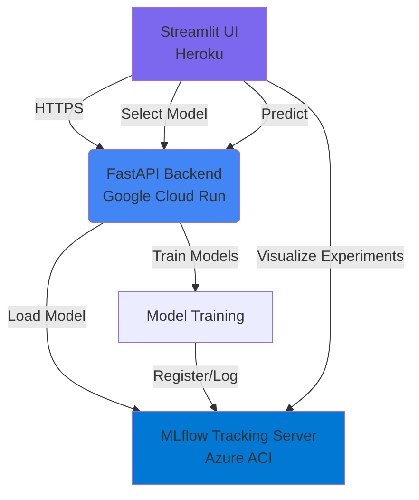

# 🚀 Agnostic MLOps Model Optimizer

This project provides a modern, modular architecture for optimizing machine learning models (PyTorch, Sklearn, TensorFlow) with **MLflow** for experiment tracking and model registry.

## ✅ Objectif (selon consignes)

Mettre en place une architecture IA composée de :
- une application web (Front)
- une API contenant un modèle de machine learning (Back)
- une solution d'hébergement de modèle (MLflow)
- une solution d’automatisation de tâches

Tous les projets sont déposés sur GitHub et les liens sont référencés dans ce README.

## 🔗 Lien GitHub (repo unique)

- Repo unique (Front + Back + MLOps) : <LIEN_GITHUB_REPO>
- Présentation / docs : https://github.com/Datascience-Ynov/Projet_final_Cloud.git

## 🧩 Conformité attendue

### Cibles de déploiement (choix du groupe)
- Front : Heroku
- Back : GCP
- MLflow : Azure

### Front – Streamlit (déploiement séparé)
- Envoie les données utilisateur vers l’API.
- Contient : `requirements.txt`, `Dockerfile`, `deploy_heroku.sh`, `app.py`.
- Déployé sur : **Heroku Container Registry**
- Variables d'environnement : `BACKEND_URL`, `MLFLOW_URL`

### Back – FastAPI (déploiement séparé)
- Reçoit les données du front, appelle le modèle, renvoie la prédiction.
- Contient : `requirements.txt`, `Dockerfile`, `deploy_gcp_local.sh`, `main.py`, `train.py`.
- Utilise des modèles Sklearn provenant d'un serveur MLflow.
- Déployé sur : **Google Cloud Run** (europe-west1)
- Variables d'environnement : `MLFLOW_TRACKING_URI`

### MLOps – MLflow (déploiement séparé)
- Suivi d'expériences et registre de modèles.
- Un fichier d'entrainement (`train.py`) est présent dans les fichiers de l'API.
- MLflow est intégré pour la traçabilité des runs et le versioning des modèles.
- Déployé sur : **Azure Container Instances** (francecentral)
- Configuration : Image `ghcr.io/mlflow/mlflow:v2.16.0`, port 5000
- URL : `http://mlflow-server-mlops-sadiya-mourad.francecentral.azurecontainer.io:5000`

### Projet
- Présentation (5 minutes).
- Documentation détaillée + diagramme d’architecture.
- README complet et pertinent.
- Tous les membres ont publié sur GitHub.

## 🏗️ Architecture Multi-Cloud



### Components:
- **Frontend (Streamlit)** - Hébergé sur **Heroku**
  - User interface pour la sélection de modèles et les prédictions
  - Déploiement via Heroku Container Registry
  - Variables d'environnement : `BACKEND_URL`, `MLFLOW_URL`
  
- **Backend (FastAPI)** - Hébergé sur **Google Cloud Run**
  - API REST avec endpoints `/models`, `/predict`, `/train`
  - Charge les modèles depuis MLflow Model Registry
  - Authentification publique, région europe-west1
  - Variables d'environnement : `MLFLOW_TRACKING_URI`
  
- **MLflow** - Hébergé sur **Azure Container Instances**
  - Tracking server pour la gestion des expériences et modèles
  - Model Registry pour le versioning des modèles
  - Backend SQLite + artifact storage dans `/tmp`
  - Accès public via HTTP port 5000

## 🛠️ Setup & Installation

1. **Install Dependencies**:
   ```bash
   pip install -r requirements.txt
   ```

2. **Prepare Sample Data** (Optional - Fashion MNIST):
   ```bash
   python prepare_test_data.py
   ```

## 🚀 Running the Project

You need to run three separate components (ideally in different terminals):

1. **Start MLflow Tracking Server**:
   ```bash
   mlflow ui --port 5000
   ```

2. **Start the API Backend**:
   ```bash
   export MLFLOW_TRACKING_URI=http://localhost:5000
   export MLFLOW_MODEL_URI=models:/fashion-mnist-sklearn/Production
   python -m uvicorn src.api.main:app --reload --port 8000
   ```

3. **Start the Frontend**:
   ```bash
   export BACKEND_URL=http://localhost:8000
   export MLFLOW_URL=http://localhost:5000
   streamlit run src/frontend/app.py
   ```

## 🧪 Train & Register a Model (MLflow)

Run the training script once to log and register a model in MLflow:

```bash
export MLFLOW_TRACKING_URI=http://localhost:5000
export EXPERIMENT_NAME=Fashion_MNIST_Training
export MODEL_NAME=fashion-mnist-sklearn
export DATA_PATH=data/fashion_mnist_agnostic.npz
python src/api/train.py
```


## 📖 User Guide (Step-by-Step)

Once all services are running, follow these steps:

1.  **Prepare Data**: Run `python prepare_test_data.py`. This creates a `data/fashion_mnist_agnostic.npz` file.
2.  **Train Models**: Run `python src/api/train.py` to train and register models in MLflow.
3.  **Access UI**: Open the Streamlit frontend in your browser.
4.  **Select Model**: Choose a registered model from the dropdown list (loaded from MLflow).
5.  **Predict**: Upload test data or use sample data for predictions.
6.  **View Experiments**: Open **MLflow** to see all experiments and model versions.

## 🔌 API Endpoints

- `GET /models` — liste tous les modèles enregistrés dans MLflow
- `POST /predict` — return predictions from MLflow model
- `GET /mlflow-info` — get tracking URI + model URI


## 🚢 Deployment Multi-Cloud

### 🔵 MLflow sur Azure Container Instances

Déploiement du serveur MLflow sur Azure ACI :

```bash
cd mlflow_deploy
./deploy_simple.sh
```

Configuration :
- Image : `ghcr.io/mlflow/mlflow:v2.16.0`
- Resource Group : `mlops-group`
- Container : `mlflow-server-mlops-sadiya-mourad`
- Backend : SQLite (`/tmp/mlflow.db`)
- Artifacts : `/tmp/mlartifacts`
- Port : 5000 (public)

### 🟢 Backend API sur Google Cloud Run

Déploiement du backend FastAPI sur GCP Cloud Run :

```bash
cd src/api
./deploy_gcp_local.sh
```

Configuration :
- Project ID : `ynov-486913`
- Region : `europe-west1`
- Service : `mlops-backend-api`
- Memory : 2Gi, CPU : 1
- Timeout : 300s
- Auth : `--allow-unauthenticated`
- Variables : `MLFLOW_TRACKING_URI=http://mlflow-server-mlops-sadiya-mourad.francecentral.azurecontainer.io:5000`

### 🟣 Frontend sur Heroku

Déploiement du frontend Streamlit sur Heroku Container Registry :

```bash
cd src/frontend
# Définir l'URL du backend GCP
BACKEND_URL='https://mlops-backend-api-xxx.run.app' ./deploy_heroku.sh
```

Configuration :
- App Name : `mlops-fashion-mnist-frontend` (configurable)
- Registry : Heroku Container Registry
- Variables automatiques :
  - `BACKEND_URL` : URL du backend GCP Cloud Run
  - `MLFLOW_URL` : URL du serveur MLflow Azure

### 📋 Variables d'environnement

**Frontend (Heroku)** :
- `BACKEND_URL` : URL du backend sur Cloud Run
- `MLFLOW_URL` : URL MLflow Azure

**Backend (Cloud Run)** :
- `MLFLOW_TRACKING_URI` : URL MLflow Azure

**MLflow (Azure ACI)** :
- Aucune variable requise (configuration via commande de démarrage)

## 📊 Features
- **Multi-Cloud Architecture**: Frontend on Heroku, Backend on GCP, MLflow on Azure
- **MLflow Integration**: Complete experiment tracking and model registry
- **Real-time Predictions**: Load models from MLflow and serve predictions via FastAPI
- **Multiple Models**: Support for SVC, RandomForest, MLP, and XGBoost models
- **Easy Deployment**: Automated deployment scripts for each cloud provider

# Projet_final_Cloud