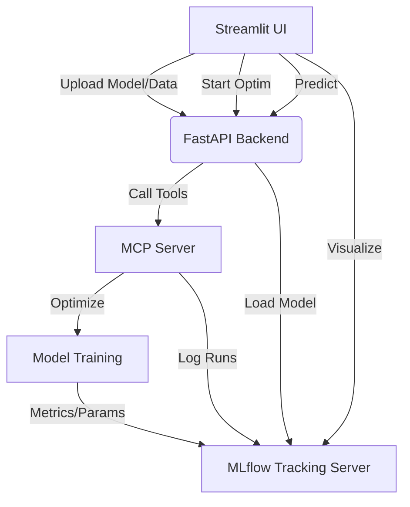

# 🚀 Agnostic MLOps Model Optimizer

This project provides a modern, modular architecture for optimizing machine learning models (PyTorch, Sklearn, TensorFlow) using **MCP (Model Context Protocol)** for task orchestration and **MLflow** for experiment tracking.

## ✅ Objectif (selon consignes)

Mettre en place une architecture IA composée de :
- une application web (Front)
- une API contenant un modèle de machine learning (Back)
- une solution d'hébergement de modèle (MLflow)
- une solution d’automatisation de tâches

Tous les projets sont déposés sur GitHub et les liens sont référencés dans ce README.

## 🔗 Lien GitHub (repo unique)

- Repo unique (Front + Back + MLOps) : <LIEN_GITHUB_REPO>
- Présentation / docs : https://github.com/Datascience-Ynov/Projet_final_Cloud.git

## 🧩 Conformité attendue

### Cibles de déploiement (choix du groupe)
- Front : Azure
- Back : GCP
- MLflow : Azure

### Front – Streamlit (déploiement séparé)
- Envoie les données utilisateur vers l’API.
- Contient : `requirements.txt`, `Dockerfile`, `push.sh`, fichier principal.
- Déployé sur : Azure.

### Back – FastAPI ou MCP (déploiement séparé)
- Reçoit les données du front, appelle le modèle, renvoie la prédiction.
- Contient : `requirements.txt`, `Dockerfile`, `push.sh`, fichier principal.
- Utilise un modèle TensorFlow, PyTorch ou Sklearn provenant d’un serveur MLflow.
- Déployé sur : GCP.

### MLOps – MLflow (déploiement séparé)
- Suivi d’expériences.
- Un fichier d’entrainement est présent dans les fichiers de l’API.
- MLflow est intégré pour la traçabilité des runs.
- Déployé sur : Azure

### Projet
- Présentation (5 minutes).
- Documentation détaillée + diagramme d’architecture.
- README complet et pertinent.
- Tous les membres ont publié sur GitHub.

## 🏗️ Architecture



### Components:
- **Frontend (Streamlit)**: User interface for uploading models/datasets and configuring hyperparameter search spaces.
- **Backend (FastAPI)**: Orchestrator that manages uploads and communicates with the MCP server using a stdio client.
- **MCP Server**: Houses the "intelligence" for optimization. It provides tools for Grid Search, Random Search, and Bayesian Optimization (via Optuna).
- **MLflow**: Centralized logging for all experiments, allowing comparison of runs and best model retrieval.

## 🛠️ Setup & Installation

1. **Install Dependencies**:
   ```bash
   pip install -r requirements.txt
   ```

2. **Prepare Sample Data** (Optional - Fashion MNIST):
   ```bash
   python prepare_test_data.py
   ```

## 🚀 Running the Project

You need to run three separate components (ideally in different terminals):

1. **Start MLflow Tracking Server**:
   ```bash
   mlflow ui --port 5000
   ```

2. **Start the API Backend**:
   ```bash
   export MLFLOW_TRACKING_URI=http://localhost:5000
   export MLFLOW_MODEL_URI=models:/fashion-mnist-sklearn/Production
   python -m uvicorn src.api.main:app --reload --port 8000
   ```

3. **Start the Frontend**:
   ```bash
   export BACKEND_URL=http://localhost:8000
   export MLFLOW_URL=http://localhost:5000
   streamlit run src/frontend/app.py
   ```

## 🧪 Train & Register a Model (MLflow)

Run the training script once to log and register a model in MLflow:

```bash
export MLFLOW_TRACKING_URI=http://localhost:5000
export EXPERIMENT_NAME=Fashion_MNIST_Training
export MODEL_NAME=fashion-mnist-sklearn
export DATA_PATH=data/fashion_mnist_agnostic.npz
python src/api/train.py
```

Then promote the model to the **Production** stage in MLflow UI and keep:
`MLFLOW_MODEL_URI=models:/fashion-mnist-sklearn/Production`

## 📖 User Guide (Step-by-Step)

Once all services are running, follow these steps to run your first optimization:

1.  **Prepare Data**: Run `python prepare_test_data.py`. This creates a `data/fashion_mnist_agnostic.npz` file.
2.  **Access UI**: Open `http://localhost:8501` in your browser.
3.  **Upload Dataset**:
    *   Click on "Browse files" in the **Upload Assets** sidebar.
    *   Select `data/fashion_mnist_agnostic.npz`.
    *   Click the **Upload Dataset** button.
4.  **Upload Model (Optional)**: If you have a `.pkl` or `.pth` model, you can upload it for detection.
5.  **Configure Search**:
    *   Select the **Model Type** (e.g., SVC).
    *   Choose a **Search Strategy** (Grid, Random, or Bayesian).
    *   Adjust the **Hyperparameter Space** (C values, Kernels, etc.).
6.  **Optimize**: Click **Start Optimization**.
7.  **Monitor**:
    *   The right column will show "Optimization in progress".
    *   Once finished, it displays the **Best Score** and **Best Parameters**.
8.  **View Detail**: Open **MLflow** at `http://localhost:5000` to see the comparison of all trials.
9.  **Predict**: Use the **Prediction** section in the UI or call the `/predict` endpoint.

## 🔌 API Endpoints

- `POST /upload-data` — upload `.npz` dataset
- `POST /upload-model` — upload `.pkl`, `.pth`, `.h5` model
- `POST /optimize` — run optimization via MCP tools
- `POST /predict` — return predictions from MLflow model
- `GET /mlflow-info` — get tracking URI + model URI

## 🔧 MCP Tools
The project includes a dedicated MCP server (`src/mcp_server/main.py`) with the following tools:
- `detect_model_framework`: Identifies model type from file content.
- `grid_search_optimizer`: Exhaustive parameter search.
- `random_search_optimizer`: Efficient randomized search.
- `bayesian_optimizer`: Intelligent search using Optuna.

## 🚢 Deployment (Docker)

Pour déployer ton serveur MLflow (cible : Azure) :

```bash
cd deploy
docker-compose up -d
```
Cela lancera un serveur MLflow sur le port 5000 avec persistance des données dans le dossier `deploy/mlflow_data`.

### Backend (Docker)

Build from the repo root so the MCP server code is included:

```bash
docker build -f src/api/Dockerfile -t mlops-backend:latest .
```

### Frontend (Docker)

```bash
docker build -f src/frontend/Dockerfile -t mlops-frontend:latest src/frontend
```

Set environment variables when running containers:

- `BACKEND_URL` for the frontend
- `MLFLOW_URL` for the frontend
- `MLFLOW_TRACKING_URI` and `MLFLOW_MODEL_URI` for the backend

## 📊 Features
- **Framework Agnostic**: Supports any model type that can be optimized via the MCP tools.
- **Real-time Logging**: All trial results are visible in the MLflow dashboard immediately.
- **Easy Deployment**: Modular structure allows deploying the MCP server, Backend, and Frontend on different cloud services as requested.

# Projet_final_Cloud